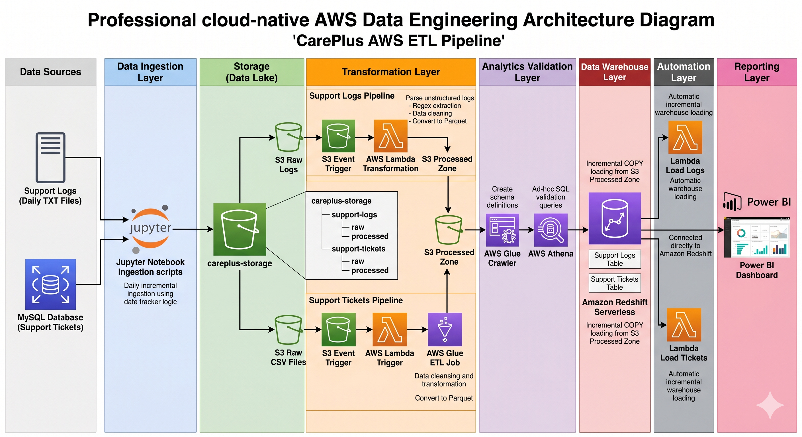
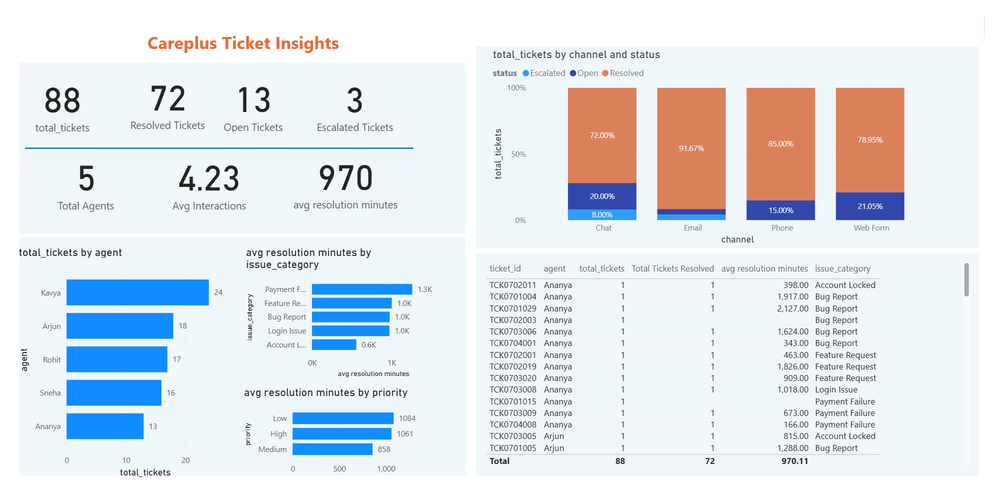
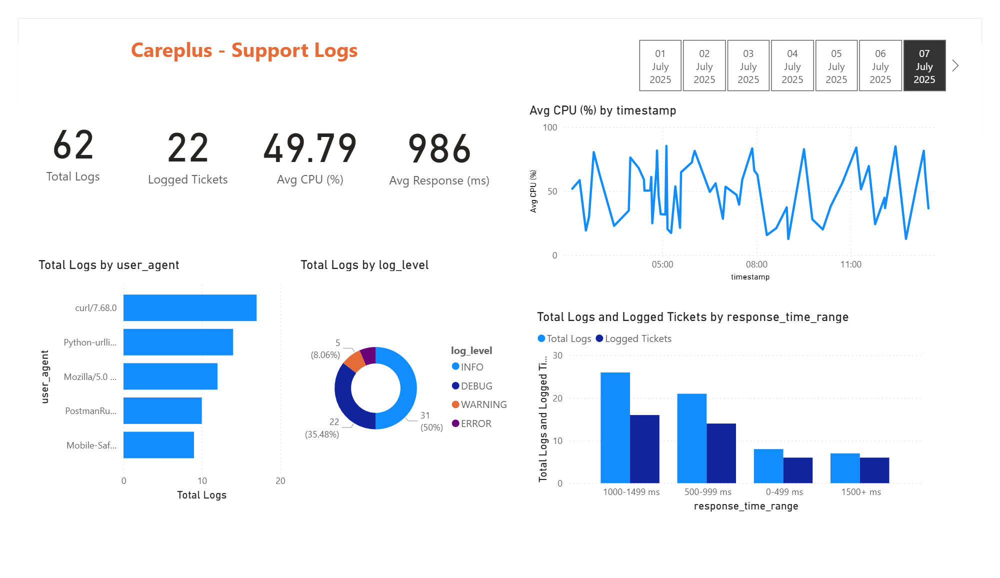

# CarePlus Support Analytics Pipeline

An end-to-end, cloud-native data engineering pipeline built on AWS that ingests customer support tickets and backend support logs, transforms raw operational data into analytics-ready datasets, loads them into a cloud data warehouse, and delivers business insights through a Power BI dashboard.

The project simulates a real-world support analytics platform for **CarePlus**, a customer support organization handling requests across multiple channels — built to gain hands-on, production-style experience with incremental ingestion, event-driven processing, serverless ETL, data lake design, automated warehouse loading, and cloud-based reporting.


> **A note on the data:** the original source data (MySQL ticket database dump + 31 days of raw log files) is course-provided content and is **not included** in this repository. A small, synthetic sample dataset with the same schema and file formats is provided in [`sample-data/`](sample-data/) so the pipeline logic can still be reviewed and re-run end-to-end.

---

## Table of Contents
- [Project Objectives](#project-objectives)
- [Architecture](#architecture)
- [Tech Stack](#tech-stack)
- [Data Sources](#data-sources)
- [Repository Structure](#repository-structure)
- [Pipeline Walkthrough](#pipeline-walkthrough)
- [Dashboard](#dashboard)
- [Skills Demonstrated](#skills-demonstrated)
- [Setup / How to Explore This Repo](#setup--how-to-explore-this-repo)
- [Challenges & Design Decisions](#challenges--design-decisions)
- [Status & Future Enhancements](#status--future-enhancements)

---

## Project Objectives

- Build a fully automated, event-driven data pipeline on AWS — from raw ingestion to BI dashboard — without manual intervention at any stage.
- Practice **two different serverless/managed ETL approaches** (AWS Lambda and AWS Glue) on two related datasets, to understand where each tool fits.
- Implement a proper **data lake architecture** (Raw / Processed zones) ahead of warehouse loading, rather than loading raw data directly into the warehouse.
- Validate data at the lake layer (via Athena) before it ever reaches the warehouse.
- Deliver an incrementally-refreshing BI dashboard that reflects new data automatically once it flows through the pipeline.

## Architecture


A layer-by-layer breakdown of the same flow (with AWS service names, S3 folder structure, and Lambda function names per step) is also available:



```
New File Uploaded
        ↓
Amazon S3 (Raw Zone)
        ↓
S3 Event Notification
        ↓
Transformation Service (AWS Lambda for logs / AWS Glue for tickets)
        ↓
Amazon S3 (Processed Zone, Parquet)
        ↓                                   ↘
AWS Glue Crawler → AWS Athena (validation)   Amazon Redshift Serverless (via Lambda + SQL COPY)
                                                        ↓
                                                    Power BI Dashboard
```

See [`architecture/README.md`](architecture/README.md) for a walkthrough of the diagram.

## Tech Stack

| Layer | Technology |
|---|---|
| Storage (Data Lake) | Amazon S3 (Raw Zone + Processed Zone) |
| Transformation | AWS Lambda (log parsing), AWS Glue — Visual ETL & script-based (ticket transformation) |
| Schema Discovery | AWS Glue Crawlers |
| Query & Validation | AWS Athena |
| Data Warehouse | Amazon Redshift Serverless |
| Reporting | Microsoft Power BI |
| Source Database | MySQL |
| File Format | Parquet |
| Processing / Scripting | Python, Pandas, Regex, SQL, boto3, psycopg2, SQLAlchemy |

## Data Sources

The pipeline processes two related datasets, ingested incrementally into S3:

**`support_tickets`** (from MySQL) — one row per customer support ticket: `ticket_id`, `created_at`, `resolved_at`, `agent`, `priority`, `issue_category`, `num_interactions`, `status`, `channel`.

**`support_logs`** (from raw backend `.log` files) — one row per system/API event tied to a ticket: `timestamp`, `log_level`, `component`, `ticket_id`, `session_id`, `ip`, `response_time`, `cpu`, `event_type`, `error`, `user_agent`, `message`, `debug`.

**Relationship**: `support_tickets` → `support_logs` via `ticket_id` (one-to-many).

Full column-level documentation lives in [`ingestion/meta_data.txt`](ingestion/meta_data.txt).

**On sample data:** the real course dataset (`careplus_support_db.sql`, 31 daily `.log` files) is deliberately excluded from this repo. [`sample-data/`](sample-data/) contains a small synthetic stand-in — 12 fabricated tickets and 20 fabricated log lines in the exact same schema/format — so every notebook here can be pointed at real files and actually run.

## Repository Structure

```
careplus-support-analytics-pipeline/
│
├── architecture/                        # Pipeline architecture diagram
├── ingestion/                           # Raw data ingestion notebooks + dataset docs
│   ├── support-logs/
│   └── support-tickets/
├── transformation/                      # AWS Lambda (logs) and AWS Glue (tickets) ETL logic
│   ├── support-log-transformation/
│   └── support-tickets-transformation/
├── warehouse/                           # Redshift table DDL + incremental COPY loading
├── analytics/                           # Athena queries, schema-check notebook, Power BI dashboard
├── sample-data/                         # Synthetic stand-in for the excluded course dataset
│   ├── support-logs/
│   └── support-tickets/
├── screenshots/                         # AWS console evidence for every pipeline stage
│
└── README.md                            # You are here
```

Each folder has its own `README.md` explaining what's inside, how it was built, and any setup notes.

## Pipeline Walkthrough

1. **Ingestion** — Two Python/Jupyter notebooks pull new records daily: ticket data from MySQL, log files from disk. Both use simple date-tracker files to ingest only new data (incremental loading pattern), uploading results to the S3 Raw Zone. See [`ingestion/`](ingestion/).
2. **Transformation** — An S3 event notification fires on new raw data. Logs are parsed and cleaned by an **AWS Lambda** function (Python/Pandas/Regex); tickets are transformed by an **AWS Glue** job, triggered from a small Lambda function that starts the Glue job run. Both outputs land as **Parquet** in the S3 Processed Zone. See [`transformation/`](transformation/).
3. **Validation** — AWS Glue Crawlers register the processed Parquet files as queryable tables; **AWS Athena** runs validation and exploratory SQL against them before anything touches the warehouse. See [`analytics/athena_queries.sql`](analytics/athena_queries.sql).
4. **Warehouse Loading** — A Lambda function (using `psycopg2`) runs SQL `COPY` operations to incrementally load validated Parquet data into **Amazon Redshift Serverless**. See [`warehouse/`](warehouse/).
5. **Reporting** — **Power BI** connects directly to Redshift. Refreshing the dashboard after new data lands in Redshift updates every visual automatically — no dashboard changes required. See [`analytics/`](analytics/).
6. **Monitoring & Security** — CloudWatch Logs track every Lambda execution; scoped IAM roles govern each service-to-service relationship (Lambda→S3, Lambda→Redshift, Glue→S3, Athena→S3). See [`screenshots/README.md`](screenshots/README.md).

## Dashboard

The Power BI file (`analytics/Careplus_Insights.pbix`) connects live to Redshift and has two report pages:

**Careplus Ticket Insights** — ticket volume, resolution status, and escalation rate; ticket load and resolution breakdown by channel (Email, Chat, Phone, Web Form); average resolution time by issue category and priority; agent-level ticket load; a record-level drill-through table.



**Careplus - Support Logs** — total logs and logged-ticket counts; average CPU and response time; a day-by-day filter strip; CPU trend over time; log volume by user agent and log level; response-time distribution.



See [`analytics/README.md`](analytics/README.md) for a full breakdown of both pages.

## Skills Demonstrated

- Incremental data ingestion design (date-tracker pattern) across two independent sources (MySQL + flat log files)
- Serverless ETL with AWS Lambda, including Python/Pandas/Regex log parsing
- Managed ETL with AWS Glue — both Visual ETL and script-based job development
- Data lake design (Raw/Processed zoning) on Amazon S3
- Schema discovery via AWS Glue Crawlers and ad-hoc validation via AWS Athena
- Event-driven automation using S3 Event Notifications and Lambda triggers
- Incremental warehouse loading into Amazon Redshift Serverless via SQL `COPY`, orchestrated from a Lambda function using `psycopg2`
- Power BI dashboard development against a live warehouse, with validated incremental refresh
- IAM role scoping across five AWS services
- CloudWatch-based pipeline monitoring and troubleshooting

## Setup / How to Explore This Repo

This repository is a **portfolio artifact**, not a deployable package — it documents a working pipeline built in a personal AWS account (no live endpoints are exposed, and all credentials/account IDs have been redacted or replaced with placeholders). To explore it:

1. Start with the architecture diagram in [`architecture/`](architecture/) for the high-level data flow.
2. Read [`ingestion/README.md`](ingestion/README.md) for dataset schemas and the ingestion pattern.
3. Review the transformation logic in [`transformation/`](transformation/) — Lambda logic for logs, Glue logic for tickets.
4. Check [`warehouse/redshift_table_creation.sql`](warehouse/redshift_table_creation.sql) for the Redshift schema and load pattern.
5. Look at [`analytics/athena_queries.sql`](analytics/athena_queries.sql) for the validation/exploratory query set, then view the dashboard screenshot or open `Careplus_Insights.pbix` in Power BI Desktop.
6. Browse [`screenshots/`](screenshots/) for console-level evidence of every stage (IAM, Lambda, Glue, Athena, Redshift, CloudWatch, S3).

**To actually run the notebooks:**
1. Use the files in [`sample-data/`](sample-data/) in place of the original course dataset — copy `sample-data/support-tickets/careplus_support_db_sample.sql` into your own MySQL instance, and `sample-data/support-logs/support_logs_sample.log` into wherever the ingestion notebook expects `day-wise-logs-data/`.
2. Copy each `sample.env` to `.env` and fill in your own AWS credentials and region.
3. Update the hardcoded `S3_BUCKET`, database credentials, IAM role ARNs, and Redshift connection details throughout the notebooks/SQL with your own values — these have been replaced with placeholders in this repo.
4. Run the ingestion notebooks, then the transformation notebooks, then the warehouse-loading notebook, in that order.

## Challenges & Design Decisions

- **Data lake + warehouse hybrid** over direct-to-warehouse loading — to separate storage concerns and enable Parquet-based validation ahead of Redshift.
- **Two ETL tools by design** — Lambda for lightweight, event-driven log parsing; Glue for structured, ticket-oriented ETL — specifically to compare the two approaches hands-on.
- **Visual ETL before script-based Glue** — validated transformation logic visually first, then converted to an automatable script job.
- **Date-tracker files for incremental ingestion** — a lightweight alternative to a full orchestrator, simulating daily production ingestion.
- **Parquet over CSV/TXT** for the Processed Zone — columnar efficiency and native Athena/Redshift compatibility.
- **Athena as an intermediate validation layer** — catching schema/quality issues before warehouse load, rather than validating only in Redshift.
- **Granular, per-relationship IAM roles** rather than broad permissions, for realistic access-control practice.

## Status & Future Enhancements

**Status:** In progress / iterative learning project. Core pipeline (ingestion → transformation → validation → warehouse → reporting) is implemented end-to-end with working event-driven automation, incremental loading, and a validated Power BI refresh flow.

**Planned enhancements:**
- Workflow orchestration with Apache Airflow
- CI/CD deployment pipelines
- Infrastructure as Code (Terraform)
- Formal data quality validation framework
- Real-time streaming ingestion
- Medallion architecture implementation
- Automated Power BI refresh scheduling

**Built by :**
- [Anshul](https://github.com/morid648) 
- [LinkedIn](https://www.linkedin.com/in/anshul-chaudhary-508138308/)

---

*This is an independent portfolio project built to demonstrate applied data engineering skills. The underlying scenario ("CarePlus") and source dataset originate from a Codebasics data engineering course exercise; the original dataset is not redistributed here — see [`sample-data/README.md`](sample-data/README.md).*
